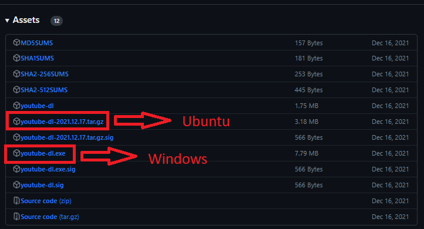
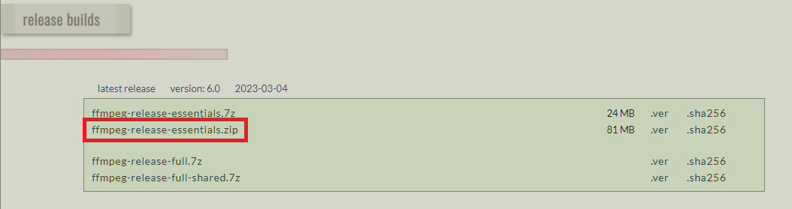
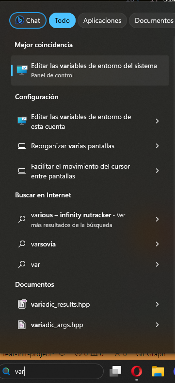
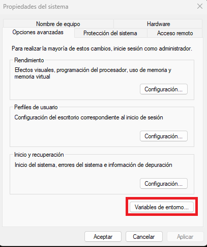
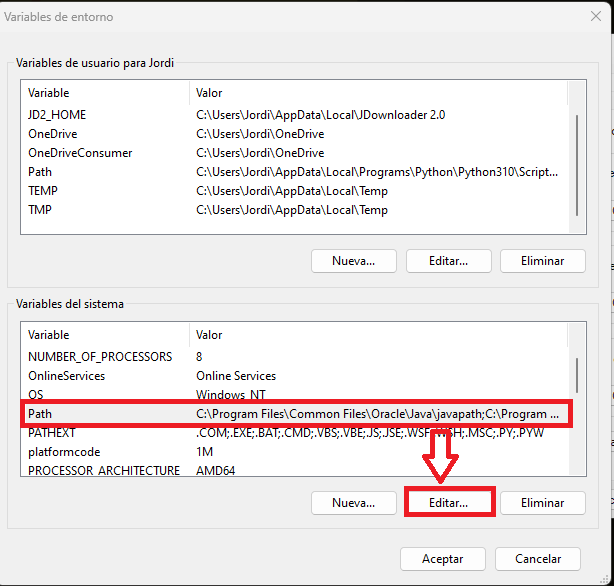
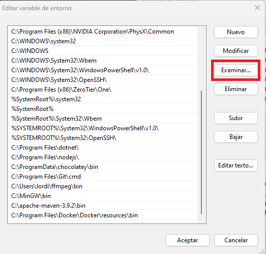
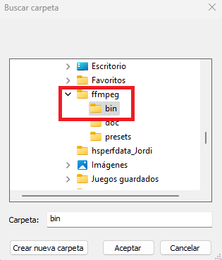
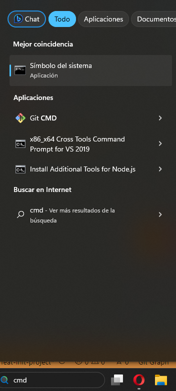
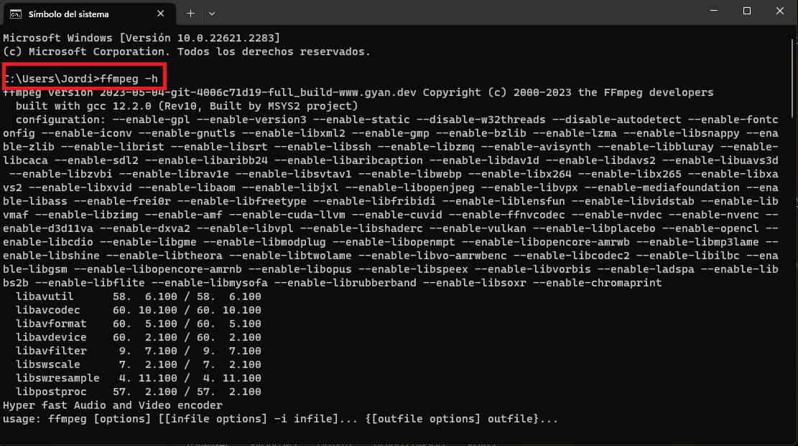

# YTDLGUI
Electron project GUI for youtube-dl 

# Instalación proyecto desarrollo
1. Instalar la última versión de NodeJs
2. Instalar las dependencias ejecutando, desde la carpeta raíz del proyecto, `npm i`
3. Instalamos las librerías externas necesarias

# Instalación de las librerías externas necesarias
## Youtube-dl
1. Navegamos a las releases del proyecto en Github: https://github.com/ytdl-org/youtube-dl/releases
2. Nos descargamos la última versión que haya
   
3. Una vez descargada la versión que toca la descomprimimos en la ruta que queramos (si es Ubuntu) o simplemente movemos el .exe a la carpeta que queramos (Windows)

## FFmpeg
### Ubuntu
1. Simplemente, ejecutamos: `sudo apt-get install ffmpeg` y se debería de instalar
### Windows
1. Navegamos a la página de descarga de FFmpeg para Windows: https://www.gyan.dev/ffmpeg/builds/
2. Vamos al apartado de Releases y nos descargamos la versión essentials:
   
3. Descomprimimos el ZIP y movemos la carpeta resultante a C:/ (en mi caso la carpeta es ffmpeg-6.0-essentials_build)
4. Después hemos de acceder a las Variables del Sistema y añadir la ruta de la carpeta al Path:

   1. Escribimos "Variables del sistema" en el buscador de Windows o si no lo tenemos desde en Menú de inicio (darle al botón de Windows de la barra de tareas)
   
   
   
   2. Seleccionamos la opción "Variables de Entorno"
   
   

   3. Hacemos clic en "Path" y después en "Editar..."
   
   

   4. Hacemos clic en "Examinar..."
   
   

   5. Seleccionamos la carpeta donde esté el ejecutable del FFmpeg que sería C:/ffmpeg-6.0-essentials_build/bin (en mi caso C:/ffmpeg/bin porque le cambie el nombre a la carpeta). Una vez seleccionado le damos a "Aceptar" en todas las ventanas para guardar la configuración.
   
   

   6. Para comprobar que está bien instalado, abrimos un Terminal
   
   

   7. Ejecutamos el comando `ffmpeg -h` y nos debería de salir toda la ayuda de la aplicacion
   
   

# Arrancar App
1. Desde la carpeta raíz del proyecto usamos el comando `npm start`

# Crear ejecutable
1. Desde la carpeta raíz del proyecto usamos el comando `npm run make`
2. Los ejecutables se crearán en la ruta /ytdl-gui/make/squirrel.windows/x64 (en el caso de Windows x64)